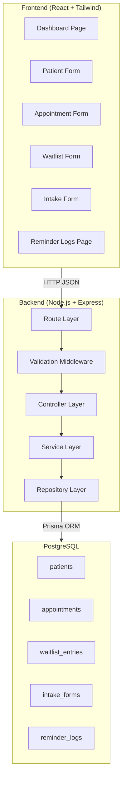
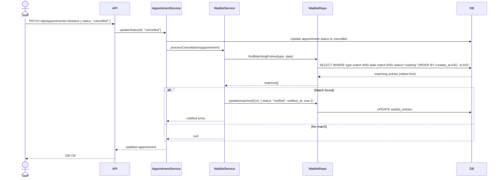
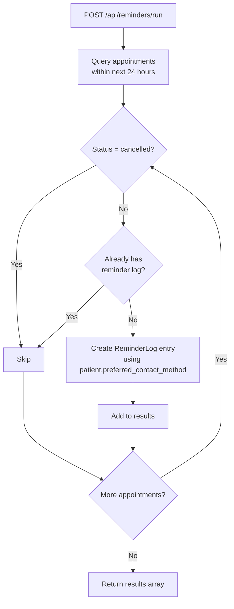

# Design Document: Smart Clinic Scheduling System

## Overview

The Smart Clinic Scheduling System is a full-stack JavaScript application using React (frontend), Node.js with Express (backend), PostgreSQL (database), and Prisma (ORM). The system follows a layered architecture: Routes → Controllers → Services → Repositories (Prisma). The frontend communicates with the backend via a RESTful JSON API. All data is persisted in PostgreSQL, and the system is containerized with Docker Compose for local development.

This design covers the Version 1 MVP: patient CRUD, appointment scheduling/rescheduling/cancellation/status tracking, simulated reminders, waitlist matching, patient intake forms, and a staff dashboard.

## Architecture



The backend uses a clean layered pattern:
- **Routes**: Define HTTP endpoints and wire middleware
- **Validators**: Validate request bodies using Joi schemas
- **Controllers**: Parse requests, call services, format responses
- **Services**: Contain business logic (waitlist matching, reminder generation, validation rules)
- **Repositories**: Thin Prisma wrappers for database access

## Components and Interfaces

### Backend Components

#### 1. Patient Module
- `patients.routes.js` — CRUD routes for `/api/patients`
- `patients.controller.js` — Request handling
- `patients.service.js` — Patient business logic (validation of required fields)
- `patients.repository.js` — Prisma queries for patients table
- `patients.validator.js` — Joi schema for patient create/update

#### 2. Appointment Module
- `appointments.routes.js` — CRUD + status routes for `/api/appointments`
- `appointments.controller.js` — Request handling
- `appointments.service.js` — Business logic: future-date validation, status transitions, triggers waitlist on cancellation
- `appointments.repository.js` — Prisma queries for appointments table
- `appointments.validator.js` — Joi schemas for create/update/status-change

#### 3. Reminder Module
- `reminders.routes.js` — Routes for `/api/reminders`
- `reminders.controller.js` — Request handling
- `reminders.service.js` — Logic: find appointments within 24h, skip cancelled, create log entries
- `reminders.repository.js` — Prisma queries for reminder_logs table

#### 4. Waitlist Module
- `waitlist.routes.js` — Routes for `/api/waitlist`
- `waitlist.controller.js` — Request handling
- `waitlist.service.js` — Logic: add to waitlist, match cancelled appointments to waitlist entries by type and date
- `waitlist.repository.js` — Prisma queries for waitlist_entries table
- `waitlist.validator.js` — Joi schema for waitlist entry

#### 5. Intake Module
- `intake.routes.js` — Routes for `/api/intake`
- `intake.controller.js` — Request handling
- `intake.service.js` — Logic: link intake to appointment, validate appointment exists
- `intake.repository.js` — Prisma queries for intake_forms table
- `intake.validator.js` — Joi schema for intake form

#### 6. Dashboard Module
- `dashboard.routes.js` — Routes for `/api/dashboard`
- `dashboard.controller.js` — Request handling
- `dashboard.service.js` — Aggregation logic: today's appointments, counts by status, waitlist activity

#### 7. Shared Middleware
- `errorHandler.js` — Global error handler returning consistent JSON error envelope
- `responseEnvelope.js` — Helper to wrap success responses in `{ data: ... }` format

### API Response Envelope

Success:
```json
{
  "data": { ... }
}
```

Error:
```json
{
  "error": {
    "message": "Validation failed",
    "details": [{ "field": "first_name", "message": "is required" }]
  }
}
```

### Frontend Components

| Page | Purpose |
|------|---------|
| Dashboard | Summary cards (today, upcoming, cancelled, no-shows, waitlist count), today's appointment list |
| Patients | Patient list table, create/edit patient modal |
| Appointments | Appointment list with filters, create/edit/cancel actions |
| Waitlist | Waitlist entries table, add-to-waitlist form |
| IntakeForm | Intake submission form linked to an appointment |
| ReminderLogs | Read-only table of reminder log entries |

The frontend uses a service layer (`src/services/`) with functions like `patientService.getAll()`, `appointmentService.create(data)`, etc., wrapping `fetch` calls to the backend API.

## Data Models

### Prisma Schema

```prisma
model Patient {
  id                    Int       @id @default(autoincrement())
  first_name            String
  last_name             String
  date_of_birth         DateTime
  phone                 String?
  email                 String?
  preferred_contact_method String? @default("email")
  created_at            DateTime  @default(now())
  updated_at            DateTime  @updatedAt

  appointments          Appointment[]
  waitlist_entries      WaitlistEntry[]
  intake_forms          IntakeForm[]
  reminder_logs         ReminderLog[]
}

model Appointment {
  id                    Int       @id @default(autoincrement())
  patient_id            Int
  provider_name         String
  appointment_type      String
  appointment_datetime  DateTime
  status                String    @default("scheduled")
  confirmation_status   String?
  notes                 String?
  created_at            DateTime  @default(now())
  updated_at            DateTime  @updatedAt

  patient               Patient   @relation(fields: [patient_id], references: [id])
  intake_form           IntakeForm?
  reminder_logs         ReminderLog[]
}

model ReminderLog {
  id                    Int       @id @default(autoincrement())
  appointment_id        Int
  patient_id            Int
  reminder_type         String
  sent_at               DateTime  @default(now())
  status                String
  message               String

  appointment           Appointment @relation(fields: [appointment_id], references: [id])
  patient               Patient     @relation(fields: [patient_id], references: [id])
}

model WaitlistEntry {
  id                        Int       @id @default(autoincrement())
  patient_id                Int
  requested_appointment_type String
  preferred_date            DateTime?
  preferred_time_range      String?
  status                    String    @default("waiting")
  notified_at               DateTime?
  created_at                DateTime  @default(now())
  updated_at                DateTime  @updatedAt

  patient                   Patient   @relation(fields: [patient_id], references: [id])
}

model IntakeForm {
  id                        Int       @id @default(autoincrement())
  patient_id                Int
  appointment_id            Int       @unique
  reason_for_visit          String
  insurance_provider        String?
  insurance_member_id       String?
  allergies                 String?
  medications               String?
  emergency_contact_name    String?
  emergency_contact_phone   String?
  notes                     String?
  submitted_at              DateTime  @default(now())

  patient                   Patient     @relation(fields: [patient_id], references: [id])
  appointment               Appointment @relation(fields: [appointment_id], references: [id])
}
```

### Status Enumerations

**Appointment Status**: `scheduled` | `confirmed` | `cancelled` | `completed` | `no_show`

**Waitlist Status**: `waiting` | `notified` | `booked` | `expired`

**Reminder Status**: `sent` | `failed`

### Key Business Rules (Service Layer)

1. Appointment date/time must be in the future at creation and rescheduling time
2. Cancelled/completed appointments cannot be rescheduled
3. Cancelling an appointment triggers waitlist matching by `appointment_type` and `preferred_date`
4. Reminders are generated only for non-cancelled appointments within 24 hours
5. Waitlist matching selects the oldest `waiting` entry that matches type and date


## Correctness Properties

*A property is a characteristic or behavior that should hold true across all valid executions of a system — essentially, a formal statement about what the system should do. Properties serve as the bridge between human-readable specifications and machine-verifiable correctness guarantees.*

The following properties were derived from the acceptance criteria in the requirements document. Each property is universally quantified and designed for property-based testing.

### Property 1: Patient creation round-trip

*For any* valid patient data (with first name, last name, and date of birth), creating a patient and then fetching that patient by ID SHALL return a record with all the same field values that were submitted.

**Validates: Requirements 1.1, 1.3**

### Property 2: Patient required field validation

*For any* patient submission where one or more required fields (first name, last name, date of birth) are missing, the System SHALL reject the submission with a 400 status code and field-level error details.

**Validates: Requirements 1.6**

### Property 3: Appointment creation defaults to scheduled

*For any* valid appointment data with a future date/time and an existing patient ID, creating the appointment SHALL produce a record with status `scheduled`.

**Validates: Requirements 2.1**

### Property 4: Past date rejection

*For any* date/time in the past, both appointment creation and appointment rescheduling SHALL be rejected with a validation error.

**Validates: Requirements 2.4, 3.2**

### Property 5: Reschedule preserves non-date fields

*For any* appointment in `scheduled` or `confirmed` status, rescheduling to a new future date/time SHALL change only the date/time field while all other fields (patient_id, provider_name, appointment_type, notes) remain unchanged.

**Validates: Requirements 3.1**

### Property 6: Terminal status appointments cannot be modified

*For any* appointment with status `cancelled` or `completed`, rescheduling or cancelling SHALL be rejected with an error.

**Validates: Requirements 3.3, 4.3**

### Property 7: Cancellation sets status and triggers waitlist

*For any* appointment in a non-terminal status, cancelling it SHALL set its status to `cancelled`. If a matching waitlist entry exists (same appointment type, compatible date), the oldest `waiting` entry SHALL be marked as `notified` with a timestamp.

**Validates: Requirements 4.1, 4.2, 7.3**

### Property 8: Status update validation and persistence

*For any* valid Appointment_Status value (`scheduled`, `confirmed`, `cancelled`, `completed`, `no_show`), updating an appointment's status SHALL persist the new value. For any string that is not a valid Appointment_Status, the update SHALL be rejected.

**Validates: Requirements 5.1, 5.2, 5.3**

### Property 9: Reminder eligibility filtering

*For any* set of appointments, running the reminder process SHALL generate reminders only for appointments that are (a) scheduled within the next 24 hours, (b) not in `cancelled` status, and (c) have not already received a reminder.

**Validates: Requirements 6.1, 6.3**

### Property 10: Reminder log completeness

*For any* reminder generated by the reminder process, the resulting log entry SHALL contain a valid appointment_id, patient_id, reminder_type, status, and non-empty message.

**Validates: Requirements 6.2**

### Property 11: Waitlist entry creation defaults to waiting

*For any* valid waitlist entry data with an existing patient ID, creating the entry SHALL produce a record with status `waiting`.

**Validates: Requirements 7.1**

### Property 12: Dashboard summary accuracy

*For any* set of appointments and waitlist entries, the dashboard summary SHALL return counts that exactly match the number of today's appointments, upcoming appointments, cancelled appointments, no-show appointments, and active waitlist entries in the database.

**Validates: Requirements 9.1, 9.2, 9.3**

### Property 13: Intake form round-trip

*For any* valid intake form data linked to an existing appointment, creating the intake form and then fetching it by appointment ID SHALL return a record with all the same field values that were submitted.

**Validates: Requirements 8.1, 8.2**

### Property 14: API response envelope consistency

*For any* successful API call, the response body SHALL contain a `data` field. *For any* failed API call (validation error or not found), the response body SHALL contain an `error` field with `message` and `details`.

**Validates: Requirements 11.1, 11.2**

### Property 15: Domain object JSON serialization round-trip

*For any* valid domain object (Patient, Appointment, WaitlistEntry, IntakeForm), serializing to JSON and deserializing back SHALL produce an equivalent object.

**Validates: Requirements 11.3**

## Waitlist and Reminder Workflows

### Waitlist Matching Flow

When an appointment is cancelled, the system automatically searches for a matching waitlist entry and notifies the oldest qualifying patient.



**Tie-breaking rule**: When multiple waitlist entries share the same `appointment_type` and `preferred_date`, the system selects the entry with the earliest `created_at`. If two entries have the same `created_at` timestamp, the entry with the lower `id` (inserted first) is selected. This guarantees a strict FIFO order with no ambiguity.

### Reminder Generation Flow

The reminder process is triggered manually via `POST /api/reminders/run`. It scans for upcoming appointments and creates log entries for eligible ones.



**Eligibility rules**:
1. Appointment datetime must be between `now` and `now + 24 hours`
2. Appointment status must not be `cancelled`
3. No existing `ReminderLog` entry for this appointment (prevents duplicates)
4. Reminder type is derived from `patient.preferred_contact_method` (defaults to `email`)

## Security and Access Control

### Current State (MVP)

The current MVP does not implement authentication. All API endpoints are accessible without credentials. This is intentional for the capstone demonstration environment where the focus is on core scheduling logic, data integrity, and testing correctness.

### Planned Security Design

The following security controls are planned for a production version:

#### Role-Based Access Control (RBAC)

| Role | Permissions |
|------|-------------|
| Admin | Full access to all resources including user management |
| Clinic Staff | Create/read/update patients, appointments, waitlist, intake forms |
| Read-Only | View appointments and dashboard only (e.g., front desk display) |

Access would be enforced via JWT middleware inserted between the route and controller layers:

```
Routes → AuthMiddleware (JWT verify) → RoleMiddleware (check role) → Controllers
```

#### Patient Data Privacy

- Patient PII (name, DOB, phone, email) should never appear in server logs
- API responses should omit sensitive fields not needed by the requesting role
- Database connections must use SSL in production (`DATABASE_URL` with `sslmode=require`)
- All patient data should be transmitted over HTTPS only

#### API Security Controls

| Control | Approach |
|---------|----------|
| Authentication | JWT Bearer tokens with expiry |
| Authorization | Role-based middleware per route |
| Input validation | Joi schemas on all POST/PUT/PATCH endpoints (already implemented) |
| Error messages | Generic messages exposed to client; details logged server-side only (already implemented) |
| Rate limiting | `express-rate-limit` middleware on all `/api/*` routes |
| CORS | Restrict `allowedOrigins` to known frontend domains in production |

#### Security Risk Matrix

| Risk | Likelihood | Impact | Mitigation |
|------|-----------|--------|------------|
| Unauthorized access to patient records | High (no auth in MVP) | High | Add JWT auth before production deployment |
| SQL injection | Low (Prisma parameterizes all queries) | High | Already mitigated by ORM |
| Sensitive data in logs | Medium | Medium | Sanitize log output, never log request bodies with PII |
| Brute force on auth endpoints | Medium | Medium | Rate limiting + account lockout |
| Insecure direct object reference | Medium | High | Validate resource ownership per request |

## Future Enhancements

### Predictive No-Show Detection

A future version of the system could reduce no-shows by identifying high-risk appointments before they occur.

**Approach**: Analyze historical appointment data to flag patients with a pattern of missed appointments. A simple rule-based implementation could mark an appointment as "at risk" if the patient has missed more than 2 of their last 5 appointments.

**Implementation path**:
1. Add a `no_show_risk` field to the `Appointment` model (`low` | `medium` | `high`)
2. Add a service function that calculates risk score based on patient history at scheduling time
3. Surface the risk indicator on the dashboard and appointment list
4. Optionally trigger an additional reminder for high-risk appointments

**This feature is out of scope for the current MVP** but the data model already captures the `no_show` status needed to build it.

### Smart Triage

A future enhancement could collect basic symptom or reason information from patients before their appointment is confirmed, allowing clinic staff to prioritize urgent cases.

**Approach**: Extend the intake form to include a triage questionnaire (symptom severity, duration, urgency level). A triage score would be calculated and surfaced to staff before the appointment.

**Implementation path**:
1. Add `triage_score` and `urgency_level` fields to `IntakeForm`
2. Add a triage question set to the intake form UI
3. Add a service function that computes urgency from responses
4. Flag high-urgency intake forms on the dashboard

**This feature is out of scope for the current MVP.** The existing `IntakeForm` model provides the foundation for this enhancement without schema changes to other models.

## Error Handling

### Validation Errors (400)
- All request bodies are validated against Joi schemas before reaching the controller
- Validation errors return `{ error: { message: "Validation failed", details: [...] } }` with field-level messages
- Date validation rejects past dates for appointment creation and rescheduling
- Status validation rejects values not in the allowed enum

### Not Found Errors (404)
- Fetching a non-existent patient, appointment, waitlist entry, or intake form returns 404
- Response format: `{ error: { message: "Patient not found", details: null } }`

### Business Logic Errors (409)
- Attempting to reschedule or cancel a terminal-status appointment returns 409 Conflict
- Response format: `{ error: { message: "Cannot modify cancelled appointment", details: null } }`

### Server Errors (500)
- Unexpected errors are caught by the global error handler
- Internal details are logged server-side but not exposed to the client
- Response format: `{ error: { message: "Internal server error", details: null } }`

## Testing Strategy

### Testing Framework
- **Unit & Integration Tests**: Jest + Supertest
- **Property-Based Tests**: fast-check (JavaScript property-based testing library)
- **Test Runner**: Jest with `--runInBand` for integration tests (database isolation)

### Dual Testing Approach

**Unit Tests** focus on:
- Service-layer business logic in isolation (mocking repositories)
- Validation schema edge cases
- Specific examples demonstrating correct behavior

**Property-Based Tests** focus on:
- Universal properties that must hold across all valid inputs
- Each correctness property above maps to one property-based test
- Minimum 100 iterations per property test
- Each test is annotated with: `// Feature: smart-clinic-scheduling, Property N: <title>`

### Test Organization

```
backend/tests/
├── unit/
│   ├── patients.service.test.js
│   ├── appointments.service.test.js
│   ├── reminders.service.test.js
│   ├── waitlist.service.test.js
│   ├── intake.service.test.js
│   └── dashboard.service.test.js
├── integration/
│   ├── patients.api.test.js
│   ├── appointments.api.test.js
│   ├── reminders.api.test.js
│   ├── waitlist.api.test.js
│   ├── intake.api.test.js
│   └── dashboard.api.test.js
└── properties/
    ├── patient.properties.test.js
    ├── appointment.properties.test.js
    ├── reminder.properties.test.js
    ├── waitlist.properties.test.js
    ├── intake.properties.test.js
    ├── dashboard.properties.test.js
    └── serialization.properties.test.js
```

### Property Test Configuration

Each property test file uses fast-check with:
```javascript
fc.assert(
  fc.property(
    arbitraryPatientData(),
    async (patientData) => {
      // Property assertion
    }
  ),
  { numRuns: 100 }
);
```

Each test is tagged with a comment referencing the design property:
```javascript
// Feature: smart-clinic-scheduling, Property 1: Patient creation round-trip
```
