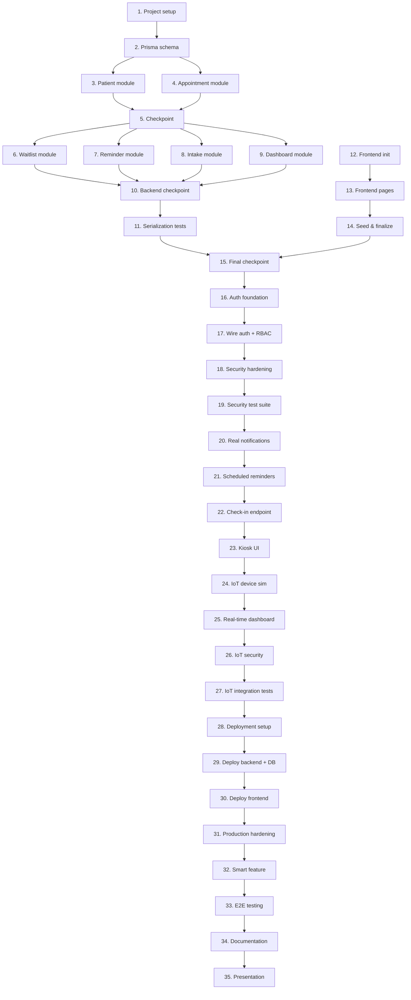

# Implementation Plan: Smart Clinic Scheduling System

## Overview

This plan implements the Smart Clinic Scheduling System using React, Node.js/Express, PostgreSQL, and Prisma. Tasks are ordered so each step builds on the previous one, with no orphaned code. Property-based tests use fast-check, unit/integration tests use Jest + Supertest. All tasks including tests are required.

The plan spans three courses:

- **Tasks 1–15 — SWE-540 (MVP build):** Core scheduling system, modules, tests, frontend, and deployment planning. (Complete except remaining test tasks.)
- **Tasks 16–19 — SWE-550 (Security):** Authentication, RBAC, hardening, and security testing.
- **Tasks 20–27 — SWE-570 (IoT & Embedded):** Real notifications, patient check-in kiosk, simulated IoT device, and real-time updates.
- **Tasks 28–35 — SWE-590 (Capstone):** Live deployment, production hardening, a smart feature, end-to-end testing, and final presentation.

See `docs/roadmap.md` for the week-by-week schedule mapping each task to a course week.

## Task Dependency Graph

Tasks are executed sequentially; each phase depends on the completion of the previous one. Within the MVP, module tasks (3, 4, 6, 7, 8, 9) precede their checkpoints (5, 10) and the serialization tests (11).



Execution waves (each wave depends on the previous; tasks within a wave may proceed in order):

```json
{
  "waves": [
    { "wave": 1, "tasks": ["1", "2"] },
    { "wave": 2, "tasks": ["3", "4", "12"] },
    { "wave": 3, "tasks": ["5", "13"] },
    { "wave": 4, "tasks": ["6", "7", "8", "9", "14"] },
    { "wave": 5, "tasks": ["10", "11", "15"] },
    { "wave": 6, "tasks": ["16"] },
    { "wave": 7, "tasks": ["17"] },
    { "wave": 8, "tasks": ["18"] },
    { "wave": 9, "tasks": ["19"] },
    { "wave": 10, "tasks": ["20"] },
    { "wave": 11, "tasks": ["21"] },
    { "wave": 12, "tasks": ["22"] },
    { "wave": 13, "tasks": ["23"] },
    { "wave": 14, "tasks": ["24"] },
    { "wave": 15, "tasks": ["25"] },
    { "wave": 16, "tasks": ["26"] },
    { "wave": 17, "tasks": ["27"] },
    { "wave": 18, "tasks": ["28"] },
    { "wave": 19, "tasks": ["29"] },
    { "wave": 20, "tasks": ["30"] },
    { "wave": 21, "tasks": ["31"] },
    { "wave": 22, "tasks": ["32"] },
    { "wave": 23, "tasks": ["33"] },
    { "wave": 24, "tasks": ["34"] },
    { "wave": 25, "tasks": ["35"] }
  ]
}
```

## Tasks

- [x] 1. Initialize project structure and configure backend
  - Create `backend/package.json` with Express, Prisma, Joi, cors, dotenv dependencies
  - Create `backend/src/app.js` with Express app setup, JSON parsing, CORS, and route mounting
  - Create `backend/src/server.js` entry point
  - Create `backend/src/middleware/errorHandler.js` global error handler returning JSON error envelope
  - Create `backend/src/middleware/responseEnvelope.js` helper for wrapping success responses in `{ data: ... }`
  - Create `.env.example` with DATABASE_URL placeholder
  - Create `docker-compose.yml` with PostgreSQL service
  - _Requirements: 10.1, 10.4, 11.1, 11.2_

- [x] 2. Define Prisma schema and generate client
  - Create `backend/prisma/schema.prisma` with Patient, Appointment, ReminderLog, WaitlistEntry, IntakeForm models as defined in the design
  - Run `npx prisma generate` to generate the Prisma client
  - Create `backend/src/config/database.js` exporting a shared PrismaClient instance
  - _Requirements: All data model requirements_

- [x] 3. Implement Patient module
  - [x] 3.1 Create patient repository, service, validator, controller, and routes
    - `backend/src/repositories/patients.repository.js` — Prisma CRUD operations
    - `backend/src/services/patients.service.js` — required field validation, delegates to repository
    - `backend/src/validators/patients.validator.js` — Joi schema for create/update
    - `backend/src/controllers/patients.controller.js` — request handling with response envelope
    - `backend/src/routes/patients.routes.js` — wire GET, POST, PUT, DELETE endpoints
    - _Requirements: 1.1, 1.2, 1.3, 1.4, 1.5, 1.6_

  - [x] 3.2 Write property tests for Patient module
    - **Property 1: Patient creation round-trip**
    - **Validates: Requirements 1.1, 1.3**
    - **Property 2: Patient required field validation**
    - **Validates: Requirements 1.6**

  - [x] 3.3 Write unit tests for Patient service
    - Test required field validation logic
    - Test edge cases: empty strings, missing fields
    - _Requirements: 1.1, 1.6_

- [x] 4. Implement Appointment module
  - [x] 4.1 Create appointment repository, service, validator, controller, and routes
    - `backend/src/repositories/appointments.repository.js` — Prisma CRUD with filtering
    - `backend/src/services/appointments.service.js` — future date validation, status transitions, patient existence check
    - `backend/src/validators/appointments.validator.js` — Joi schemas for create/update/status
    - `backend/src/controllers/appointments.controller.js` — request handling
    - `backend/src/routes/appointments.routes.js` — wire GET, POST, PUT, PATCH, DELETE endpoints
    - _Requirements: 2.1, 2.2, 2.3, 2.4, 2.5, 3.1, 3.2, 3.3, 4.1, 4.3, 5.1, 5.2, 5.3_

  - [x] 4.2 Write property tests for Appointment module
    - **Property 3: Appointment creation defaults to scheduled**
    - **Validates: Requirements 2.1**
    - **Property 4: Past date rejection**
    - **Validates: Requirements 2.4, 3.2**
    - **Property 5: Reschedule preserves non-date fields**
    - **Validates: Requirements 3.1**
    - **Property 6: Terminal status appointments cannot be modified**
    - **Validates: Requirements 3.3, 4.3**
    - **Property 8: Status update validation and persistence**
    - **Validates: Requirements 5.1, 5.2, 5.3**

  - [x] 4.3 Write unit tests for Appointment service
    - Test future date validation
    - Test status transition logic
    - Test patient existence check
    - _Requirements: 2.4, 3.3, 5.1_

- [x] 5. Checkpoint - Ensure patient and appointment modules work
  - Ensure all tests pass, ask the user if questions arise.

- [ ] 6. Implement Waitlist module
  - [x] 6.1 Create waitlist repository, service, validator, controller, and routes
    - `backend/src/repositories/waitlist.repository.js` — Prisma CRUD with matching query
    - `backend/src/services/waitlist.service.js` — add entry, match on cancellation (by type and date, oldest first)
    - `backend/src/validators/waitlist.validator.js` — Joi schema for waitlist entry
    - `backend/src/controllers/waitlist.controller.js` — request handling
    - `backend/src/routes/waitlist.routes.js` — wire GET, POST, PATCH endpoints
    - _Requirements: 7.1, 7.2, 7.3, 7.4, 7.5_

  - [x] 6.2 Integrate waitlist processing into appointment cancellation
    - Update `appointments.service.js` to call `waitlist.service.processCancellation()` when an appointment is cancelled
    - _Requirements: 4.2, 7.2, 7.3_

  - [x] 6.3 Write property tests for Waitlist module
    - **Property 7: Cancellation sets status and triggers waitlist**
    - **Validates: Requirements 4.1, 4.2, 7.3**
    - **Property 11: Waitlist entry creation defaults to waiting**
    - **Validates: Requirements 7.1**

  - [x] 6.4 Write unit tests for Waitlist service
    - Test matching logic: type match, date match, oldest-first selection
    - Test no-match scenario
    - _Requirements: 7.2, 7.3, 7.5_

- [ ] 7. Implement Reminder module
  - [x] 7.1 Create reminder repository, service, controller, and routes
    - `backend/src/repositories/reminders.repository.js` — Prisma queries for reminder_logs
    - `backend/src/services/reminders.service.js` — find eligible appointments (within 24h, not cancelled, not already reminded), create log entries
    - `backend/src/controllers/reminders.controller.js` — request handling
    - `backend/src/routes/reminders.routes.js` — wire GET, POST endpoints
    - _Requirements: 6.1, 6.2, 6.3, 6.4_

  - [ ] 7.2 Write property tests for Reminder module
    - **Property 9: Reminder eligibility filtering**
    - **Validates: Requirements 6.1, 6.3**
    - **Property 10: Reminder log completeness**
    - **Validates: Requirements 6.2**

  - [x] 7.3 Write unit tests for Reminder service
    - Test 24-hour window filtering
    - Test cancelled appointment exclusion
    - Test duplicate reminder prevention
    - _Requirements: 6.1, 6.3_

- [ ] 8. Implement Intake module
  - [x] 8.1 Create intake repository, service, validator, controller, and routes
    - `backend/src/repositories/intake.repository.js` — Prisma CRUD
    - `backend/src/services/intake.service.js` — validate appointment exists, link to patient
    - `backend/src/validators/intake.validator.js` — Joi schema for intake form
    - `backend/src/controllers/intake.controller.js` — request handling
    - `backend/src/routes/intake.routes.js` — wire GET, POST, PUT endpoints
    - _Requirements: 8.1, 8.2, 8.3, 8.4_

  - [ ] 8.2 Write property tests for Intake module
    - **Property 13: Intake form round-trip**
    - **Validates: Requirements 8.1, 8.2**

  - [ ] 8.3 Write unit tests for Intake service
    - Test appointment existence validation
    - Test intake form creation and retrieval
    - _Requirements: 8.1, 8.4_

- [ ] 9. Implement Dashboard module
  - [x] 9.1 Create dashboard service, controller, and routes
    - `backend/src/services/dashboard.service.js` — aggregate counts: today's appointments, upcoming, cancelled, no-shows, active waitlist
    - `backend/src/controllers/dashboard.controller.js` — request handling
    - `backend/src/routes/dashboard.routes.js` — wire GET endpoints
    - _Requirements: 9.1, 9.2, 9.3_

  - [ ] 9.2 Write property tests for Dashboard module
    - **Property 12: Dashboard summary accuracy**
    - **Validates: Requirements 9.1, 9.2, 9.3**

- [ ] 10. Checkpoint - Ensure all backend modules work
  - Ensure all tests pass, ask the user if questions arise.

- [ ] 11. Write serialization property tests
  - [ ] 11.1 Write property tests for API envelope and serialization
    - **Property 14: API response envelope consistency**
    - **Validates: Requirements 11.1, 11.2**
    - **Property 15: Domain object JSON serialization round-trip**
    - **Validates: Requirements 11.3**

- [x] 12. Initialize frontend application
  - Create React app in `frontend/` with Vite
  - Install Tailwind CSS, React Router, and configure base layout
  - Create `frontend/src/services/api.js` base fetch wrapper
  - Create shared layout component with sidebar navigation
  - _Requirements: All frontend-related_

- [ ] 13. Implement frontend pages
  - [x] 13.1 Create Dashboard page
    - Display summary cards (today, upcoming, cancelled, no-shows, waitlist count)
    - Display today's appointment list
    - Fetch from `/api/dashboard/summary` and `/api/dashboard/today`
    - _Requirements: 9.1, 9.2_

  - [x] 13.2 Create Patients page
    - Patient list table with create/edit modal
    - Fetch from `/api/patients`, POST/PUT for create/update
    - _Requirements: 1.1, 1.2, 1.3, 1.4_

  - [x] 13.3 Create Appointments page
    - Appointment list with status/date filters
    - Create, reschedule, cancel, and status-change actions
    - Fetch from `/api/appointments`
    - _Requirements: 2.1, 2.2, 3.1, 4.1, 5.1_

  - [x] 13.4 Create Waitlist page
    - Waitlist entries table with add-to-waitlist form
    - Fetch from `/api/waitlist`
    - _Requirements: 7.1, 7.4_

  - [x] 13.5 Create Intake Form page
    - Intake submission form linked to an appointment
    - Fetch from `/api/intake`
    - _Requirements: 8.1, 8.2_

  - [x] 13.6 Create Reminder Logs page
    - Read-only table of reminder log entries
    - Fetch from `/api/reminders/logs`
    - _Requirements: 6.4_

- [x] 14. Create seed script and finalize
  - Create `scripts/seed.js` to populate database with sample patients, appointments, waitlist entries, and intake forms
  - Create `README.md` with project description, tech stack, setup instructions, and feature list
  - _Requirements: All_

- [ ] 15. Final checkpoint - Full system verification
  - Ensure all tests pass, ask the user if questions arise.

---

# Phase 2: Security (SWE-550)

Harden the application: authentication, authorization, defensive programming, and security testing. Builds on the completed MVP.

- [ ] 16. Implement authentication foundation
  - Add `User` model to `backend/prisma/schema.prisma` (id, email, password_hash, role, name, created_at, updated_at) and run migration
  - Create `backend/src/repositories/users.repository.js` — Prisma CRUD for users
  - Create `backend/src/services/auth.service.js` — register (hash password with bcrypt), login (verify password, issue JWT)
  - Create `backend/src/validators/auth.validator.js` — Joi schemas for register/login
  - Create `backend/src/controllers/auth.controller.js` and `backend/src/routes/auth.routes.js` — wire `POST /api/auth/register`, `POST /api/auth/login`
  - Write unit tests for auth service (password hashing, login success/failure, token issuance)
  - _Requirements: Security design — Authentication_

- [ ] 17. Wire authentication and RBAC to all routes
  - Apply `authMiddleware` (JWT verify) to all `/api/*` routes except auth endpoints
  - Apply `requireRole` per the role-permission matrix (Admin, Staff, Provider, Read-Only)
  - Update frontend `api.js` to attach the JWT token and add a login page
  - Write integration tests confirming protected routes reject unauthenticated/unauthorized requests
  - _Requirements: Security design — RBAC, Role-Permission Matrix_

- [ ] 18. Security hardening (defensive programming)
  - Add `express-rate-limit` on `/api/*` routes
  - Restrict CORS `allowedOrigins` to the known frontend domain via env config
  - Add request body size limits
  - Ensure logs never contain patient PII or request bodies
  - _Requirements: Security design — API Security Controls_

- [ ] 19. Security test suite
  - RBAC tests: unauthenticated (401), wrong role (403), expired token, tampered signature
  - PII-leak tests: error responses and logs contain no patient data
  - Input-validation security tests: SQL injection, XSS payload, oversized body, invalid IDs
  - Run `npm audit` and document dependency risk review
  - _Requirements: Security Test Plan (design.md)_

---

# Phase 3: IoT & Embedded (SWE-570)

Extend the secured application with a real notification pipeline, patient self check-in, and a simulated IoT device with real-time dashboard updates.

- [ ] 20. Real notification integration
  - Integrate an email/SMS provider (SendGrid or Twilio) behind a notification service abstraction
  - Replace the simulated reminder send with real delivery; record provider status in `ReminderLog`
  - Keep a test/dev mode that logs instead of sending
  - _Requirements: Future enhancement — real notifications_

- [ ] 21. Scheduled reminder job
  - Add a scheduled job (node-cron) that runs the reminder process automatically on an interval
  - Make interval and enable/disable configurable via env
  - _Requirements: Known limitation — manual reminder trigger_

- [ ] 22. Patient check-in endpoint
  - Add a `checked_in` state and `checked_in_at` to the `Appointment` model; run migration
  - Create `POST /api/checkin` (by appointment or confirmation code) that transitions the appointment to checked-in
  - Write unit tests for check-in rules (only valid, non-terminal appointments can check in)
  - _Requirements: IoT feature — self check-in_

- [ ] 23. Check-in kiosk UI
  - Create a tablet-style kiosk page in the frontend for patient self check-in
  - Simple flow: enter confirmation code / lookup, confirm, show success
  - _Requirements: IoT feature — self check-in_

- [ ] 24. Simulated IoT check-in device
  - Create a standalone device simulator (Node script) that sends check-in / occupancy events to the backend over HTTP or MQTT
  - Document how to run the simulator
  - _Requirements: IoT feature — embedded device_

- [ ] 25. Real-time dashboard updates
  - Push check-in and occupancy events to the staff dashboard live (WebSocket or polling)
  - Show checked-in patients and waiting-room count on the dashboard
  - _Requirements: IoT feature — real-time updates_

- [ ] 26. IoT security
  - Authenticate device requests with a device token / API key
  - Enforce TLS for device communication in production config
  - Write tests for device auth (valid/invalid/missing token)
  - _Requirements: Security design applied to IoT_

- [ ] 27. IoT integration tests and demo
  - End-to-end test: device sends check-in -> appointment updates -> dashboard reflects it
  - Document the IoT feature and demo steps
  - _Requirements: IoT feature verification_

---

# Phase 4: Capstone — Deploy & Present (SWE-590)

Deploy the system live, harden for production, add a differentiating smart feature, and prepare the final presentation.

- [ ] 28. Deployment setup
  - Choose host (managed container platform + managed PostgreSQL)
  - Create production environment config and secrets management
  - Document production `DATABASE_URL` with `sslmode=require`
  - _Requirements: Deployment_

- [ ] 29. Deploy backend and database
  - Deploy the backend container and provision managed PostgreSQL
  - Run migrations and seed against production
  - Verify HTTPS and health endpoint
  - _Requirements: Deployment_

- [ ] 30. Deploy frontend
  - Build and deploy the frontend (Nginx) wired to the production API
  - Verify login and core flows against the live backend
  - _Requirements: Deployment_

- [ ] 31. Production hardening
  - Add health checks, monitoring, and error tracking
  - Run production smoke tests
  - Confirm rate limiting, CORS, and SSL are active in production
  - _Requirements: Pre-production security phase (design.md)_

- [ ] 32. Smart feature (capstone differentiator)
  - Implement predictive no-show detection OR smart triage (per design.md future enhancements)
  - Add the required schema fields, service logic, and dashboard surfacing
  - Write tests for the new feature
  - _Requirements: Future Enhancements (design.md)_

- [ ] 33. Full end-to-end testing
  - Test complete user journeys against the live environment: login -> schedule -> check-in -> reminder -> dashboard
  - Fix any issues found
  - _Requirements: All_

- [ ] 34. Capstone documentation
  - Final report: architecture, security summary, IoT feature, deployment
  - Demo script and/or recorded walkthrough
  - _Requirements: All_

- [ ] 35. Capstone presentation and final submission
  - Live demo of the deployed system
  - Final submission
  - _Requirements: All_

---

## Notes

- Tasks 1–15 are the SWE-540 MVP build. All modules, the frontend, and deployment planning are complete; the remaining unchecked items are the outstanding property/unit test tasks (6.3, 7.2, 8.2, 8.3, 9.2, 11.1).
- Tasks 16–35 extend the same project across SWE-550 (security), SWE-570 (IoT), and SWE-590 (capstone). One task is implemented per course week — see `docs/roadmap.md`.
- Property-based tests use fast-check; unit/integration tests use Jest + Supertest.
- The three open decisions (IoT feature, capstone smart feature, deployment target) are tracked in `docs/roadmap.md` and can be confirmed closer to their weeks.
